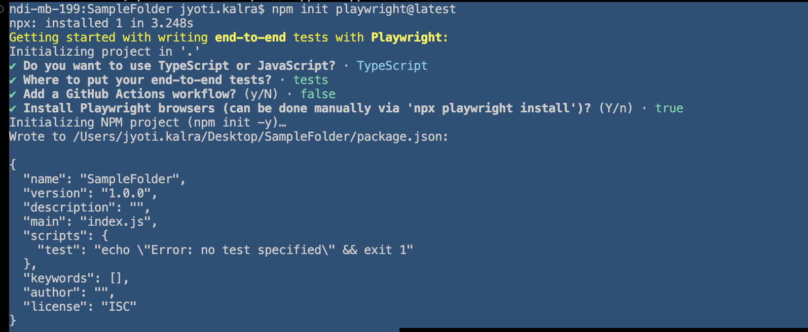

# Command-Line Setup Steps

These steps are required no matter which IDE you prefer

## Checkout Project

Clone the project to your machine: 

### In Terminal 

```
git clone https://github.com/kalrajyoti/udemy-playwright-8.git
```

## Install Node/NPM/NVM

 requires node 14 or higher. Head to [NodeJS.org](https://nodejs.org) and download the latest LTS version. 

Alternately, NVM is a Node Version Manager that makes it easy to have access to the right version, in case you need to use multiple versions of Node. 

```
curl -o- https://raw.githubusercontent.com/nvm-sh/nvm/v0.39.2/install.sh | bash
nvm install 14
nvm use 14 
nvm alias default 14
```

## Install Playwright

```
cd ~/Projects/api-automation
npm init playwright@latest
```

The initializer will prompt you with several questions. Accept all the defaults by hitting `Enter` for all of them:

